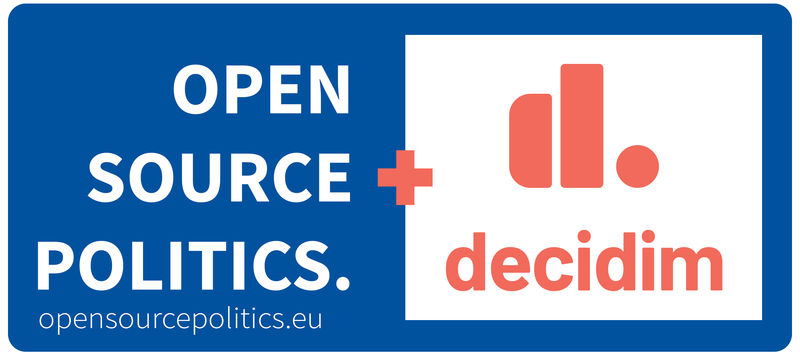

This is a fork repository.

We are actually working on the 0.16-stable version which can be found [here](https://github.com/OpenSourcePolitics/decidim/tree/0.16-stable).

The original Decidim participatory democracy framework github can be found [here](https://github.com/decidim/decidim).

#### What is Decidim

> Free Open-Source participatory democracy, citizen participation and open government for cities and organizations

[Decidim](https://decidim.org) is a participatory democracy framework, written in Ruby on Rails, originally developed for the Barcelona City government online and offline participation website. Installing these libraries will provide you a generator and gems to help you develop web applications like the ones found on [example applications](#example-applications) or like [our demo application](http://staging.decidim.codegram.com).

All members of the Decidim community agree with [Decidim Social Contract or Code of Democratic Guarantees](http://www.decidim.org/contract/).

---

[](https://github.com/opensourcepolitics/decidim/graphs/contributors)
[](http://rubydoc.info/github/decidim/decidim/master)
[](https://gitter.im/open-source-politics/Lobby)

Code quality

[](https://circleci.com/gh/OpenSourcePolitics)
[](https://codeclimate.com/github/OpenSourcePolitics/decidim/maintainability)
[](https://codeclimate.com/github/OpenSourcePolitics/decidim/test_coverage)
[](https://crowdin.com/project/opensourcepoliticsdecidim)
[](http://inch-ci.org/github/OpenSourcePolitics/decidim)

---

# What do you need to do?

* [Getting started with Decidim](#getting-started-with-decidim)
* [Contribute to the project](#how-to-contribute)
* [Modules](#modules)
* [Create & browse development app](#browse-decidim)

---

## Getting started with Decidim

TLDR: install gem, generate a Ruby on Rails app, enjoy.

```console
gem install decidim
decidim decidim_application
```

We've set up a guide on how to install, set up and upgrade Decidim. See the [Getting started guide](https://github.com/decidim/decidim/blob/master/docs/getting_started.md).

## How to contribute

See [Contributing](CONTRIBUTING.md).

### Browse Decidim

After you create a development app (`bundle exec rake development_app`), you
have to switch to it and boot the rails server with `cd development_app &&
bundle exec rails s`.

After that, you can:

* Browse the main interface at `http://localhost:3000`, and log in as: user@example.org | decidim123456
* Browse the admin interface at `http://localhost:3000/admin`, and log in as: admin@example.org | decidim123456
* Browse the system interface at `http://localhost:3000/system`, and log in as: system@example.org | decidim123456

Also, if you want to verify yourself against the default authorization handler use a document number ended with "X".

## Modules

### Official (stable)

| Module                                                                                                    | Description                                                                                                                                                                                                                                         |
| --------------------------------------------------------------------------------------------------------- | ----------------------------------------------------------------------------------------------------------------------------------------------------------------------------------------------------------------------------------------------------|
| [API](https://github.com/decidim/decidim/tree/master/decidim-api)                                         | Exposes a GraphQL API to programatically interact with the Decidim platform via HTTP.                                                                                                                                                               |
| [Accountability](https://github.com/decidim/decidim/tree/master/decidim-accountability)                   | Adds an accountability section to any participatory space so users can follow along the state of the accepted proposals.                                                                                                                            |
| [Admin](https://github.com/decidim/decidim/tree/master/decidim-admin)                                     | Adds an administration dashboard so users can manage their organization and all other entities.                                                                                                                                                     |
| [Assemblies](https://github.com/decidim/decidim/tree/master/decidim-assemblies)                           | Permanent participatory spaces.                                                                                                                                                                                                                     |
| [Blogs](https://github.com/decidim/decidim/tree/master/decidim-blogs)                                     |  This component makes possible to add posts ordered by publication time to spaces.                                                                                                                                                                  |
| [Budgets](https://github.com/decidim/decidim/tree/master/decidim-budgets)                                 | Adds a participatory budgets system to any participatory space.                                                                                                                                                                                     |
| [Comments](https://github.com/decidim/decidim/tree/master/decidim-comments)                               | The Comments module adds the ability to include comments to any resource which can be commentable by users.                                                                                                                                         |
| [Conferences](https://github.com/decidim/decidim/tree/master/decidim-conferences)                         | This module will be a configurator and generator of Conference pages, understood as a collection of Meetings, with program, inscriptions and categories                                                                                             |
| [Consultations](https://github.com/decidim/decidim/tree/master/decidim-consultations)                     |  This module creates a new space for decidim to host consultations: debates around critical questions and a proxy for eVoting                                                                                                                       |
| [Core](https://github.com/decidim/decidim/tree/master/decidim-core)                                       | The basics of Decidim: users, organizations, etc. This is the only required engine to run Decidim, all the others are optional.                                                                                                                     |
| [Debates](https://github.com/decidim/decidim/tree/master/decidim-debates)                                 | The Debates module adds debate to any participatory process. It adds a CRUD engine to the admin and public view scoped inside the participatory process.                                                                                            |
| [Dev](https://github.com/decidim/decidim/tree/master/decidim-dev)                                         | Aids the local development of Decidim's components.                                                                                                                                                                                                 |
| [Generators](https://github.com/decidim/decidim/tree/master/decidim-generators)                           | It helps you with generating decidim applications & new components. It provides the `decidim` executable.                                                                                                                                           |
| [Initiatives](https://github.com/decidim/decidim/tree/master/decidim-initiatives)                         | Initiatives is the place on Decidim's where citizens can promote a civic initiative. Unlike participatory processes that must be created by an administrator, Civic initiatives can be created by any user of the platform.                         |
| [Meetings](https://github.com/decidim/decidim/tree/master/decidim-meetings)                               | The Meeting module adds meeting to any participatory space. It adds a CRUD engine to the admin and public view scoped inside the participatory space.                                                                                               |
| [Pages](https://github.com/decidim/decidim/tree/master/decidim-pages)                                     | The Pages module adds static page capabilities to any participatory space. It basically provides an interface to include arbitrary HTML content to any step.                                                                                        |
| [Participatory Processes](https://github.com/decidim/decidim/tree/master/decidim-participatory_processes) | The main concept of a Decidim installation: participatory processes.                                                                                                                                                                                |
| [Proposals](https://github.com/decidim/decidim/tree/master/decidim-proposals)                             | The Proposals module adds one of the main components of Decidim: allows users to contribute to a participatory space by creating proposals.                                                                                                         |
| [Sortitions](https://github.com/decidim/decidim/tree/master/decidim-sortitions)                           |  This component makes possible to select randomly a number of proposals among a set of proposals (or a category of proposals within a set) maximizing guarantees of randomness and avoiding manipulation of results by the administrator.           |
| [Surveys](https://github.com/decidim/decidim/tree/master/decidim-surveys)                                 | Adds the ability for admins to create arbitrary surveys.                                                                                                                                                                                            |
| [System](https://github.com/decidim/decidim/tree/master/decidim-system)                                   | Multitenant Admin to manage multiple organizations in a single installation.                                                                                                                                                                        |
| [Verifications](https://github.com/decidim/decidim/tree/master/decidim-verifications)                     | Offers several methods for allowing participants to get authorization to perform certain privileged actions. This module implements several of those methods and also offers a way for installation to implement their custom verification methods. |

### Community

If you need to have some features that we don't have yet, we recommend that you make a module. This is a Ruby on Rails engine with some APIs specific to Decidim (for registering with the menus, integration with spaces like Participatory Processes or Assemblies, with /admin or /api, etc).

As a base you can use these modules, although check first that the version is compatible with your current Decidim version. Also you should know that until v1.0.0 We're under development and these internal APIs can change. We recommend that you extensively test your module.

| Module                                                                                                                 | Version |  Description                                                                                                                                                  |
| -----------------------------------------------------------------------------------------------------------------------| -------- | ------------------------------------------------------------------------------------------------------------------------------------------------------------ |
| [Age Action Authorization](https://github.com/diputacioBCN/decidim-diba/tree/master/decidim-age_action_authorization)  |  0.9.3   | A Decidim based action authorization to check user's age inside actions.                                                                                     |
| [Antivirus](https://github.com/mainio/decidim-module-antivirus) |  0.15.0 | Virus scanning validation for uploaded attachments based on ClamAV. |
| [Calendar](https://github.com/castilla-lamancha/participa-castillalamancha/tree/master/decidim-calendar)               |  0.14.1  | Adds a calendar view for all the Meetings, without regarding the Participatory Process or Assembly that they belong.                                         |
| [Crowdfunding](https://github.com/podemos-infoparticipa2/tree/master/decidim-module-crowdfundings)                     |  0.14.1  | This rails engine implements a Decidim component that allows to the administrators to configure crowfunding campaigns for a participatory space.             |
| [DataViz](https://github.com/AjuntamentdeBarcelona/decidim-barcelona/tree/master/decidim-dataviz)                      |  0.13.1  | The Dataviz module adds the PAM data visualizations to any participatory process but it is intended to be used just for the PAM participatory process.       |
| [Gravity Forms](https://github.com/podemos-info/participa2/tree/master/decidim-module-gravity_forms)                   |  0.14.1  | A gravity forms component for Decidim.                                                                                                                       |
| [LDAP](https://github.com/diputacioBCN/decidim-diba/tree/master/decidim-ldap)                                          |  0.9.3   | User authentication via LDAP                                                                                                                                 |
| [News](https://github.com/castilla-lamancha/participa-castillalamancha/tree/master/decidim-news)                       |  0.14.1  | This will add an admin dashboard to manage news posts and front-end views for posts.                                                                         |
| [Members](https://github.com/ElectricThings/decidim-members)                                                           |  0.13.1  | Members list and search plugin for Decidim                                                                                                                   |
| [Personal Number](https://github.com/PierreMesure/decidim-module-personal_number)                                      |  0.11.0.pre | This module allows users to register with a personal number and to log in with it.                                                                        |
| [Pol.is](https://github.com/OpenSourcePolitics/decidim-polis)                                                          |  0.7.1   | Pol.is integration on Decidim                                                                                                                                |
| [Questions](https://github.com/OpenSourcePolitics/decidim-questions)                                                   |  0.12.2  | Questions / Views / Inputs based on decidim-proposals.                                                                                                       |
| [Riksdagen](https://github.com/DinRiksdag/decidim-module-riksdagen)                                                    |  0.11.0.pre | A Decidim module to integrate some of the open data produced by the Swedish parliament                                                                    |
| [User Export](https://github.com/OpenSourcePolitics/decidim-user-export)                                               |  0.8.3   | Allow user export                                                                                                                                            |
| [Votings](https://github.com/podemos-info/participa2/tree/master/decidim-module-votings)                               |  0.14.1  | An administrator can add one or more votings to a participatory process or assambly                                                                          |

## Following our license

If you plan to release your application you'll need to publish it using the same license: GPL Affero 3. We recommend doing that on GitHub before publishing, you can read more on "[Being Open Source From Day One is Especially Important for Government Projects](http://producingoss.com/en/governments-and-open-source.html#starting-open-for-govs)". If you have any trouble you can contact us on [Gitter](https://gitter.im/decidim/decidim).
