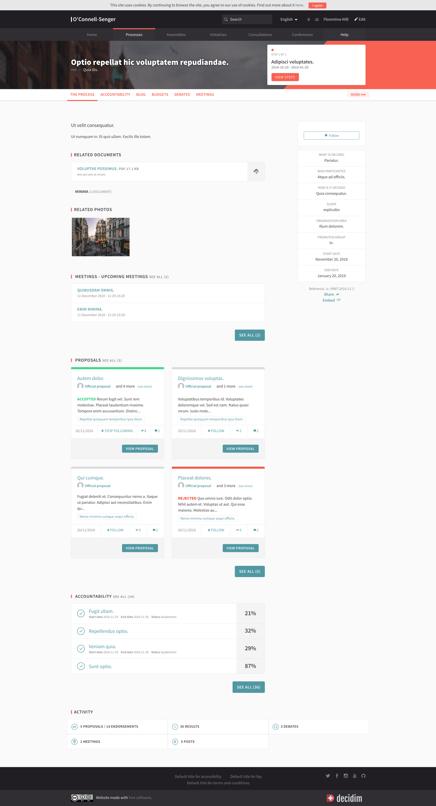
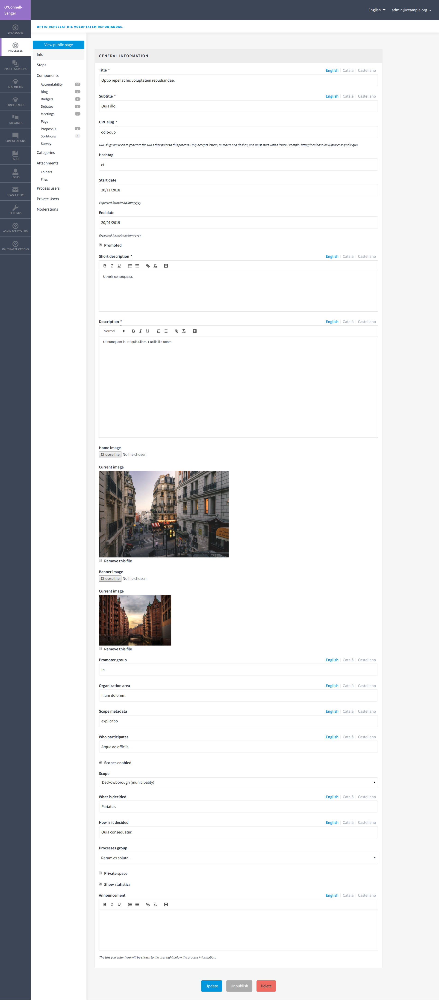

# Decidim::ParticipatoryProcesses

Participatory processes are the standard Decidim's participatory space.

A participatory process:

* can define its own steps
* can define helper text
* can attach different components (such as meetings or proposals) with different configurations to each of them.
* can have attachments
* can be associated to custom categories
* can be promoted
* can be a private process, and only users with permissions can see the process
* special content can be added to the process or superprocess home
* can show statistics on process home.
* are fully manageable via an administration UI.

## Usage

This module provides:

* A CRUD engine to manage participatory processes.

* Public views for participatory process via a high level section in the main menu.

## Installation

This is on the default Decidim installation so you shouldn't change anything to use this participatory space.

## Screenshots

## Contributing

See [Decidim](https://github.com/decidim/decidim).

## License

See [Decidim](https://github.com/decidim/decidim).
