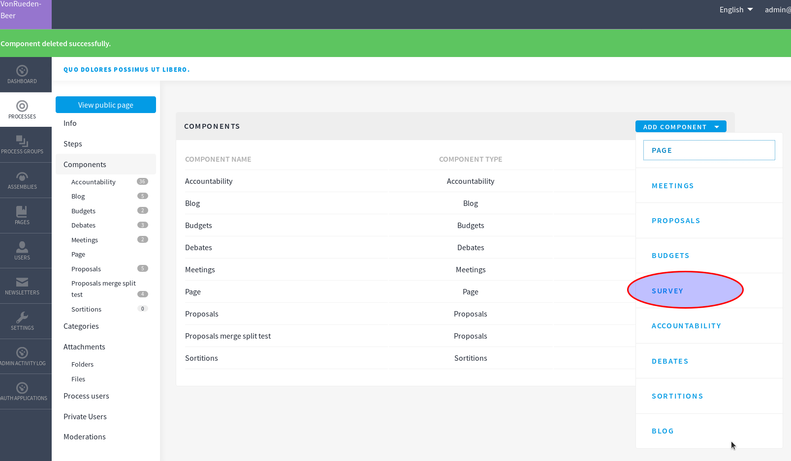
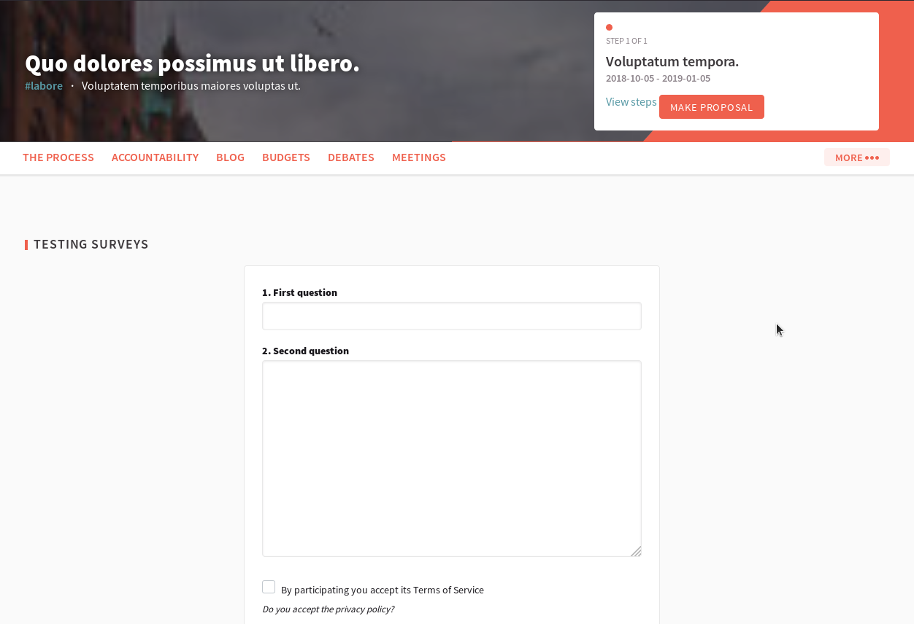

# Decidim::Surveys

The Surveys module adds one new component to Decidim: defining and answering surveys.

The main features are:

* Admins can define a Survey.
* Users can participate on these surveys by answering from the public page.
* Admins can download the answers by CSV.

## Usage

Surveys will be available as a Component for a Participatory Process.

## Installation

This is on the default Decidim installation so you shouldn't change anything to use this component.

## Screenshots

## Contributing

See [Decidim](https://github.com/decidim/decidim).

## License

See [Decidim](https://github.com/decidim/decidim).
